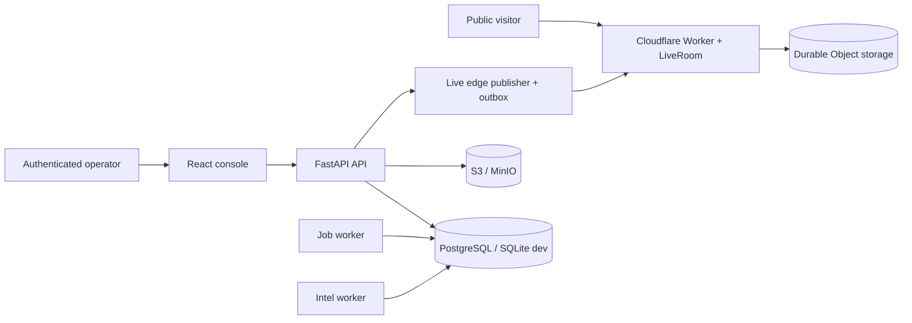

# SeaCommons

[](https://github.com/suezcanalxyz/seacommons/actions/workflows/ci.yml)
[](https://github.com/suezcanalxyz/seacommons/actions/workflows/codeql.yml)
[](./LICENSE)

Open-source maritime search-and-rescue and awareness platform. SeaCommons
turns real-time distress signals into an operational picture: it normalizes
reports from multiple sources into canonical incidents, runs Lagrangian
drift trajectories, and distributes a privacy-filtered public Live map — while
keeping operational and personal data behind authentication.

It is a working system, deployed and running. This repository is maintained
at production-engineering standard: typed domain contracts, blocking CI
quality/security gates, realtime reliability invariants encoded as tests, and
canonical architecture documentation.

## Live surfaces

| Surface | URL | What it is |
| --- | --- | --- |
| Institutional site | https://seacommons.org | Public information; no operational data |
| Public Live map | https://live.seacommons.org | Privacy-filtered incident map (read-only, no login) |
| Public demo | https://play.seacommons.org | Isolated SAR-simulation sandbox |
| Public Live edge | https://seacommons-edge.seacommons.workers.dev/health | Cloudflare Worker + Durable Object distributing Public Live |

## What is operational vs experimental

| Area | Status |
| --- | --- |
| Incident ingestion, normalization, lifecycle | **operational** |
| Public/private policy and canonical Live projection | **operational** |
| Realtime Public Live (edge Worker + outbox + reconnect) | **operational** |
| OpenDrift `Leeway` / `OceanDrift` trajectories with configurable forcing | **operational** |
| Authenticated operational console (Live, Intel, drift, vessels, cases) | **operational** |
| Live AIS, weather and marine-current feeds | **operational** (per-deployment keys) |
| Live CMEMS / ERA5 forcing readers inside drift | **planned** |
| Client-side (Pyodide) drift, immersive Unreal renderer | **experimental** |
| Onboard hardware sensor node (infrasound / seismic / SDR) | **research** |

## Architecture

SeaCommons is a modular monorepo with four deployable surfaces. It is not a
microservice system: the operational backend is one FastAPI application with
optional worker processes that share its database and domain code.



Read the canonical design docs before diving into the code:
[Architecture](./docs/ARCHITECTURE.md) ·
[Data flow](./docs/DATA_FLOW.md) ·
[Security model](./docs/SECURITY_MODEL.md) ·
[Realtime architecture](./docs/REALTIME_ARCHITECTURE.md) ·
[Testing strategy](./docs/TESTING.md) ·
[full index](./docs/README.md)

## Tech stack

- **Backend** — Python 3.12, FastAPI, SQLAlchemy, PostgreSQL (SQLite for dev),
  Prometheus, OIDC/JWT (Keycloak), S3/MinIO
- **Drift** — OpenDrift (`Leeway`, `OceanDrift`) via a dedicated interpreter
- **Frontend** — React 19, Vite, Cesium, MapLibre GL, TypeScript domain contracts
- **Public Live edge** — Cloudflare Workers + Durable Objects
- **CI** — GitHub Actions: pytest, ruff, mypy, ESLint, `npm audit` / `pip-audit`,
  gitleaks, CodeQL, `wrangler` dry-run

## Repository layout

```text
apps/
  api/   FastAPI backend, drift engine, forensic pipeline, integrations
  web/   React/Vite operational console
  edge/  Cloudflare Worker and Durable Object for Public Live
  site/  Static institutional website
  unreal/ Experimental immersive renderer
deploy/  Container, reverse-proxy and systemd manifests
docs/    Canonical architecture, contracts, runbooks
scripts/ Local developer entrypoints
tests/   Backend + cross-runtime contract tests
```

## Run it locally

No database server needed; the default is SQLite.

```bash
git clone https://github.com/suezcanalxyz/seacommons.git
cd seacommons
cp .env.example .env
python -m pip install -e "apps/api[dev]"
npm --prefix apps/web ci
bash scripts/run_dev.sh all          # Windows: powershell -File scripts/start.ps1
```

Console at http://localhost:5173, API at http://localhost:8000 (`/docs` for the
OpenAPI UI). Full setup, test and contribution guide:
[docs/DEVELOPMENT.md](./docs/DEVELOPMENT.md).

Submit a mock distress signal to exercise the pipeline (drift job + forensic
signing + witness broadcast):

```bash
curl -X POST http://localhost:8000/api/v1/alert \
  -H "Content-Type: application/json" \
  -d '{"lat":35.123,"lon":15.456,"timestamp":"2026-03-21T12:00:00Z","persons":45,"vessel_type":"rubber_boat","domain":"ocean_sar"}'
```

## Deployment

Three modes — self-hosted production (Docker Compose), zero-cost live demo
(Cloudflare Pages/Vercel + Oracle Free), and the Public Live edge Worker.
See [docs/DEPLOYMENT.md](./docs/DEPLOYMENT.md) and
[docs/CONFIGURATION.md](./docs/CONFIGURATION.md).

## OpenDrift runtime

The backend calls a real OpenDrift simulation through a dedicated interpreter
(`OPENDRIFT_PYTHON`). Constant forcing is configurable via `OPENDRIFT_WIND_X/Y`,
`OPENDRIFT_CURRENT_X/Y`, `OPENDRIFT_PARTICLES`, `OPENDRIFT_TIMESTEP_SECONDS`,
`OPENDRIFT_OUTPUT_SECONDS`. Live CMEMS/ERA5 forcing readers are the planned
next step.

## Hardware sensor node (research)

A ship-mounted node design for passive detection. Bill of materials in
[docs/BOM.md](./docs/BOM.md); ~€240–410 depending on the infrasound option.

## License and contributing

Licensed under [AGPL-3.0-or-later](./LICENSE). See
[CONTRIBUTING.md](./CONTRIBUTING.md) and, for AI-assisted changes,
[docs/AI_ENGINEERING_POLICY.md](./docs/AI_ENGINEERING_POLICY.md). Report
vulnerabilities through the repository's private security advisory channel,
never a public issue.
