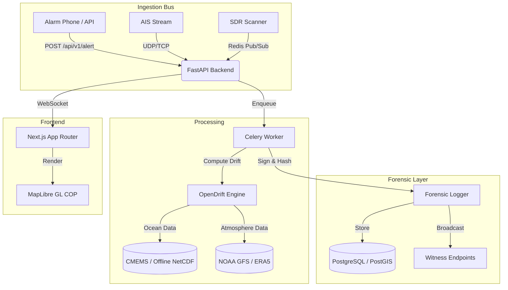

# Architecture

```mermaid
graph TD
    subgraph Ingestion Bus
        A[Alarm Phone / API] -->|POST /api/v1/alert| B(FastAPI Backend)
        C[AIS Stream] -->|UDP/TCP| B
        D[SDR Scanner] -->|Redis Pub/Sub| B
    end

    subgraph Processing
        B -->|Enqueue| E[Celery Worker]
        E -->|Compute Drift| F[OpenDrift Engine]
        F -->|Ocean Data| G[(CMEMS / Offline NetCDF)]
        F -->|Atmosphere Data| H[(NOAA GFS / ERA5)]
    end

    subgraph Forensic Layer
        E -->|Sign & Hash| I[Forensic Logger]
        I -->|Store| J[(PostgreSQL / PostGIS)]
        I -->|Broadcast| K[Witness Endpoints]
    end

    subgraph Frontend
        B -->|WebSocket| L[Next.js App Router]
        L -->|Render| M[MapLibre GL COP]
    end
```
