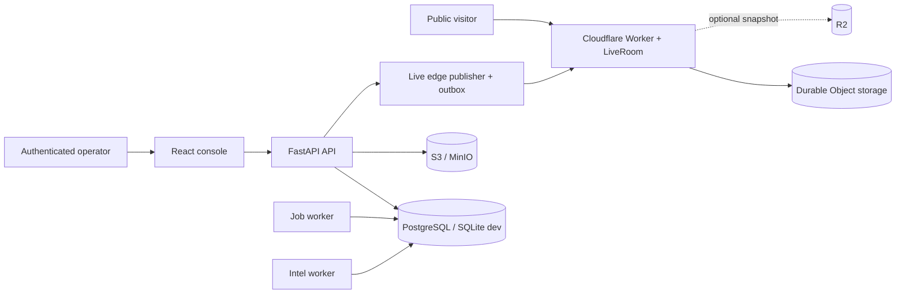

# SeaCommons architecture

Status: canonical architecture description. Last reviewed: 2026-08-26.

SeaCommons is a modular monorepo with four deployable surfaces. It is not a
microservice system: the operational backend is one FastAPI application, with
optional worker processes that share its database and domain code.

## Deployable surfaces

| Surface | Code | Responsibility |
|---|---|---|
| Institutional site | `apps/site` | Static public information; no operational data |
| Operational console | `apps/web` | React/Vite UI for Live, Intel, drift, vessels, cases and connectors |
| API and workers | `apps/api` | Authentication, ingestion, domain policy, persistence, jobs and integrations |
| Public Live edge | `apps/edge` | Privacy-filtered public snapshot and WebSocket distribution |



## Backend boundaries

HTTP routes live under `core/api/routes`. Routes parse transport input and
delegate Live/Intel decisions to `core/live` and `core/intel` services. Shared
vocabulary and validation models live under `core/domain`; provider-specific
code remains in `core/ingestion`, `core/integrations`, `core/intel` and related
subsystems.

The intended dependency direction is:

```text
route / process entrypoint
        -> domain service / projection
        -> store or integration adapter
        -> database / provider
```

Domain policy must not move back into route handlers. In particular, public
Live publication is governed by `core/domain/live_contracts.py`,
`core/intel/public_policy.py`, `core/intel/public_geometry.py` and
`core/live/projection.py`.

## Supported process topologies

Development can run the API, intel monitors and scheduler in one process. A
production deployment separates responsibilities:

- API: `core.api.main`, with `INTEL_MONITORS_ENABLED=false`;
- intel worker: `python -m core.intel_worker_main`;
- durable job worker: `python -m core.worker` with `JOB_EXECUTION_MODE=queue`;
- edge publisher: `python -m core.live_edge_publisher`.

The API-side `intel-db-sync` thread refreshes its read cache from the shared
database when monitors run elsewhere. Its success, failure streak and recovery
are exported as Prometheus metrics. Production startup fails if authentication,
OIDC, object storage or queued job execution are not configured.

## Storage ownership

- PostgreSQL is the production system of record. SQLite is supported for local
  development, tests and the publisher outbox.
- S3-compatible object storage owns attachments and large artifacts.
- The in-process intel store is a cache/read model backed by the database; it is
  not an independent source of truth.
- Cloudflare Durable Object storage owns the ephemeral public Live snapshot.
  Optional R2 storage mirrors the latest public snapshot only.
- Browser storage is a degraded/offline cache and never authoritative.

## Architectural invariants

- User-originated signals are private by default.
- Only the canonical public projection may cross into Public Live.
- Unknown source policies and contract-invalid payloads fail closed.
- Missing coordinates stay missing; approximate/area geometry carries explicit
  precision metadata.
- Duplicate edge delivery is idempotent and one incident has one visible latest
  version.
- A stale version cannot resurrect a newer removed/resolved incident.
- Source heartbeat freshness and event recency are separate states.

The executable tests for these invariants live in `tests/test_live_contracts.py`,
`tests/test_live_feed.py`, `tests/test_live_edge_publisher.py` and
`apps/edge/src/live.test.js`.

## Related canonical documents

- [Data flow](DATA_FLOW.md)
- [Security model](SECURITY_MODEL.md)
- [Realtime architecture](REALTIME_ARCHITECTURE.md)
- [Contract catalogue](contracts/README.md)
- [Production operations](PRODUCTION_RUNBOOK.md)

Historical audits and deployment evidence are indexed in [docs/README.md](README.md).
