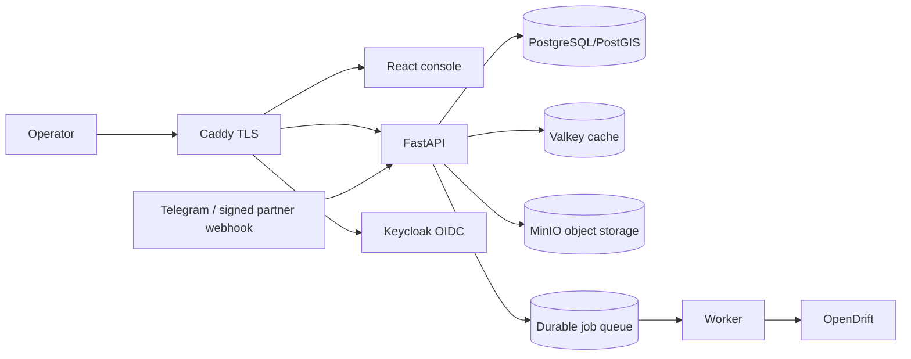

# Architecture

## Current implementation

The current application is a React/Vite/MapLibre console backed by FastAPI and
SQLAlchemy. SQLite is supported only for local development. Production uses
PostgreSQL/PostGIS, Valkey, Keycloak and Caddy. Drift and some ingestion work is
still executed in API background threads; durable workers are a target, not a
current capability.

## Target boundary

Drift and alert simulations use a database-backed durable queue in production,
with leases, retry backoff and dead-letter state. Media extraction and report
generation still need to move to the worker before those paths can scale
horizontally.
