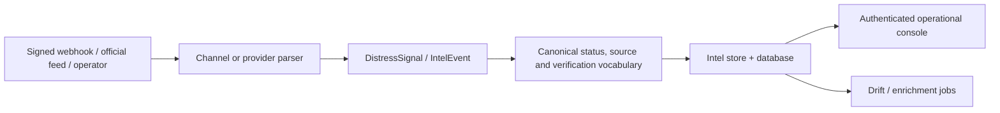
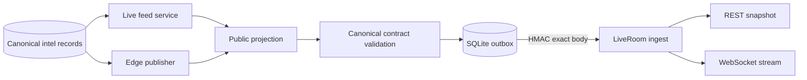
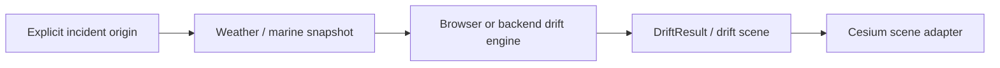

# SeaCommons data flow

Status: canonical data-flow description. Last reviewed: 2026-08-26.

## Inbound signal to operational state

Webhook routes verify provider authenticity before parsing. `DistressSignal`
defaults to `publication_status=private`; a parser cannot make a user report
public by omission. Provider observations become `IntelEvent` records carrying
source policy, verification and coordinate provenance metadata.

The database is the durable boundary. The in-memory intel store accelerates
reads and broadcasts but persists additions/updates and is repopulated from the
database at startup. In split deployment, the API periodically imports changes
written by the standalone intel worker.

## Operational state to Public Live

Both VM feed and edge publisher reuse the same lifecycle, public-policy,
geometry and projection functions. The public projection removes raw/private
text, blocks non-approved source policies and validates the final feature or
event. Edge ingestion validates the public vocabulary again and rejects private
visibility.

The publisher uses an at-least-once SQLite outbox. Event IDs are deterministic
per material incident version; acknowledged versions are remembered, retries
use backoff, and explicit removal events clear incidents that no longer qualify.

## Realtime delivery to browsers

The edge keeps one Durable Object room for Public Live. A new WebSocket receives
a snapshot before incremental messages. REST snapshot polling is the first
recovery fallback, followed by the VM public feed and finally the last local
browser snapshot. Transport status is derived from heartbeat age, not merely
from the presence of old events.

The operational console also has a direct authenticated API realtime path. It
may contain richer data and must never be treated as interchangeable with the
public edge payload.

## Drift data flow

Drift inputs and outputs use versioned schemas in `docs/contracts`. Missing
origin geometry does not trigger a fabricated coordinate. Modelled output is
labelled as derived/modelled and is not promoted to verified observation.

## Data classification and retention

| Class | Examples | Permitted surfaces |
|---|---|---|
| Private operational | Raw caller text, contact identifiers, attachments | Authenticated API/object storage only |
| Internal derived | Review state, unverified extraction, analyst notes | Authenticated console |
| Public projected | Redacted event, approved source URL, coarse geometry | Public Live edge |
| Ephemeral cache | In-memory store, browser snapshot, edge Live snapshot | Rebuildable; never sole evidence store |

Retention and backup policy are deployment responsibilities described in
`PRODUCTION_RUNBOOK.md`. Immutable/public networks must never receive private or
sensitive operational records.
