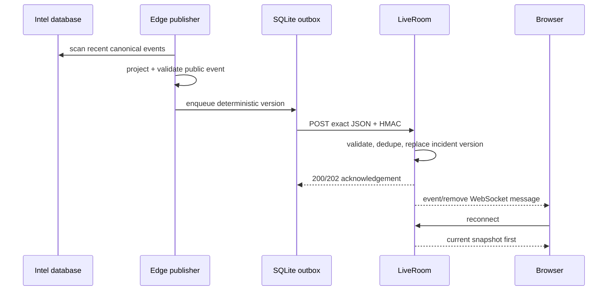

# SeaCommons realtime architecture

Status: canonical realtime design. Last reviewed: 2026-08-26.

## Two realtime planes

SeaCommons intentionally has two planes:

- the authenticated operational plane, served directly by FastAPI and allowed
  to contain internal detail;
- Public Live, served by a Cloudflare Worker/Durable Object and restricted to
  canonical public projections.

They share domain lifecycle semantics but not payload breadth or authorization.

## Public Live event path

The outbox provides at-least-once delivery and survives publisher restart.
LiveRoom deduplicates exact event IDs. Material changes receive a deterministic
new version ID, and only the latest version for an `incident_id` remains visible.

## Ordering and lifecycle invariants

- A stale version cannot replace a newer incident state.
- Duplicate delivery does not duplicate a marker or advance the hash head.
- Explicit `incident_removed`/`expired` events remove the visible incident.
- A resolved/removed incident cannot be resurrected by an older observation.
- `kind` describes signal type; `incident_lifecycle` independently describes
  active/resolved/review/archive state.
- TTL expiration removes stale edge records without reclassifying content.

Every accepted event stores `previous_hash` and its own hash, producing a
tamper-evident ordered head within the Durable Object. This is integrity
metadata, not a blockchain or permanent evidence ledger.

## Snapshot, stream and fallback

`/v1/live/stream` is the primary browser transport. On connection, the Durable
Object sends a complete snapshot before incremental messages. The client then
falls back in this order:

1. Edge REST snapshot;
2. rate-limited VM public Live feed;
3. last valid local browser snapshot.

Each snapshot is validated before application. Reconnect logic owns one active
generation, so messages from an older socket cannot overwrite a newer
connection. UI status separates source heartbeat freshness from the timestamp
of the newest event: a quiet but healthy source is `LIVE`, while old events with
no heartbeat are `DEGRADED` or `OFFLINE`.

## Source health and observability

Publishers send signed heartbeats independently of event delivery. LiveRoom
marks heartbeats offline after the configured maximum age. Backend Prometheus
metrics expose durable worker heartbeats, intel source totals, API/worker sync
attempts, consecutive failures and last successful sync time.

Operators should alert on:

- consecutive intel DB sync failures greater than or equal to three;
- no successful sync beyond the expected 30-second interval plus tolerance;
- stale publisher heartbeat;
- growing/retrying publisher outbox;
- zero live workers when queued jobs exist.

## Recovery properties

| Failure | Expected behavior |
|---|---|
| Edge unavailable | Publisher retains pending events and retries with backoff |
| Publisher restart | SQLite outbox and delivered-version memory survive |
| API restart | Edge snapshot remains available; API cache reloads from DB |
| Intel worker unavailable | API serves last durable state; sync/source metrics expose degradation |
| WebSocket interruption | Client reconnects and receives snapshot before deltas |
| Duplicate publish | Edge returns duplicate success without changing visible state |

Operational procedures, failure drills and rollback commands remain in
`FEDERATED_LIVE_RUNBOOK.md` and `LIVE_FIRST_CUTOVER.md`.
