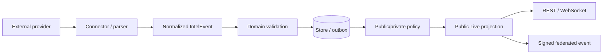

# SeaCommons data contracts

These files describe the payloads that cross runtime and trust boundaries. They
are implementation contracts, not product aspirations.

## Canonical flow

External payloads are never public contracts. Connectors first normalize them
to an internal `IntelEvent`; publication policy and public geometry are applied
after normalization. The VM Live feed and edge publisher use the same backend
vocabulary from `core.domain.live_contracts`.

## Canonical concepts

- `publication_status`: `private`, `internal`, or `published`. Explicit
  `private` is absolute.
- `source_policy`: provenance/transport policy. Blocked unofficial policies
  never enter a public feed, even when another field says published.
- `verification_status`: evidence label, not a truth claim. Named tracked-source
  labels such as `alarm_phone_twitter` remain valid provenance.
- `location_precision`: describes what the geometry means; `unpositioned` is
  represented by `geometry: null`, and area reports use Polygon/MultiPolygon.
- `incident_lifecycle`: `active`, `resolved`, `needs_review`, or `archived`.
  It is independent from `kind`, which remains `distress` or `context`.
- incident identity is stable across versions; federated event `id` identifies a
  material version, while `properties.incident_id` identifies the incident.

## Contracts

- `live-domain-v1.schema.json`: shared vocabulary and public geometry.
- `live-signal-v1.schema.json`: VM public GeoJSON feature.
- `seacommons-event-v1.schema.json`: event after edge normalization and hash
  chaining.
- scenario, environment, drift trajectory, and scene schemas define the browser
  simulation boundary independently from received Live signals.

Contract changes require deterministic tests in `tests/test_live_contracts.py`
and, for edge normalization, `apps/edge/src/live.test.js`.
